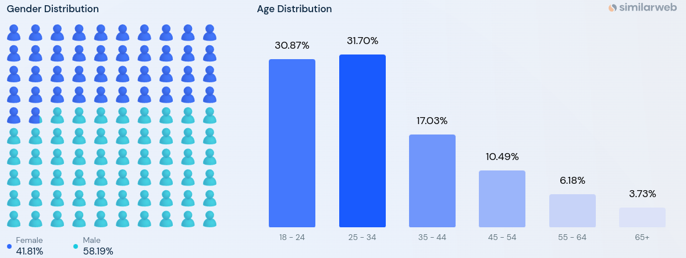

# Highload-Spotify

[Методические указания](https://github.com/init/highload/blob/main/homework_architecture.md)

## Содержание

* ### [Тема и целевая аудитория](#1)
* ### [Использованные источники](#8)

## 1. Тема и целевая аудитория 
**Spotify** —  стриминговый сервис, позволяющий легально прослушивать музыкальные композиции, аудиокниги и подкасты, не скачивая их на устройство.

### Целевая аудитория

**Spotify** является мировым лидером в области музыкального стриминга и имеет на 2022-й год 30.5% от общей доли продаваемых подписок, что составляет 187.8 млн. пользователей.[^1]

По данным [^2] Spotify имеет 456 млн. активных пользователей, которые наиболее всего представлены лицами от 25 до 35 лет [^3]

Распределение пользователей по регионам [^3]:
| **Страна** | **Общаяя доля, %** |
|-----------|-------------------------------------------|
| USA      | 28.23%                                       |
| Brazil   | 4.61%                                       |
| UK       | 4.47%                                       |
| Mexico   | 4.27%                                      |
| India    | 3.90%                                      |
| остальные.. | 54.52%                                      |

C 7 апреля 2022 года в РФ Spotify стал недоступен.[^4]

### MVP

- Стриминг музыкальных произведений
- Рекомендации на освоне прослушанных треков
- Получение информации об исполнителе и произведении
- Добавление трека
- Создание плейлиста

<!-- ## 2. Расчет нагрузки 
## 3. Логическая схема 
## 4. Физическая схема 
## 5. Технологии 
## 6. Схема проекта 
## 7. Список серверов  -->

## Использованные источники 
[^1]: [Music subscriber market shares 2022](https://midiaresearch.com/blog/music-subscriber-market-shares-2022)

[^2]: [Number of Spotify monthly active users. Statista](https://www.statista.com/statistics/367739/spotify-global-mau/)

[^3]: [similarweb Spotify statistic](https://www.similarweb.com/ru/website/spotify.com/#overview)

[^4]: [Spotify остановил работу в России](https://habr.com/ru/news/t/660157/)