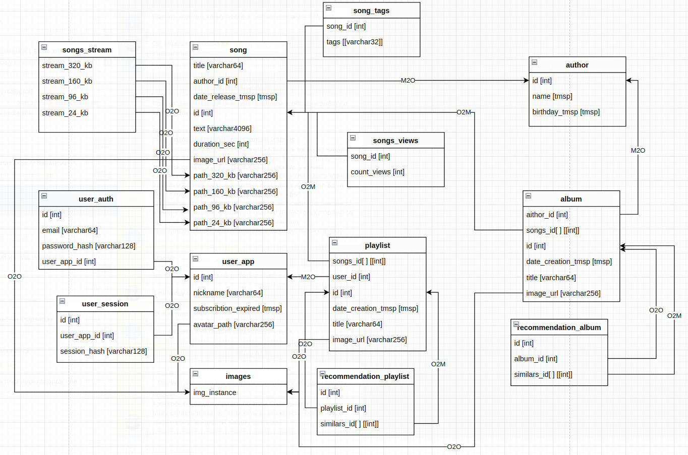
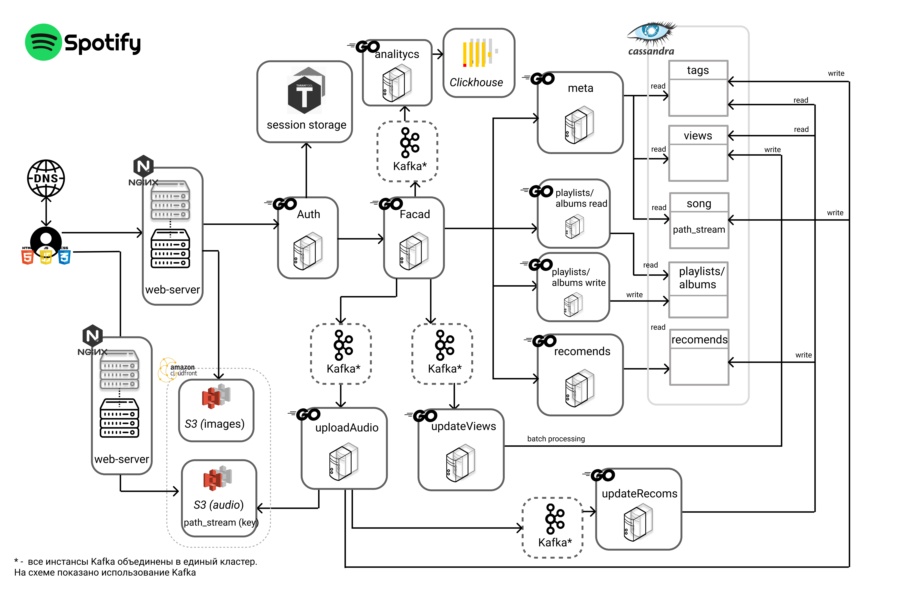

# Highload-Spotify

[Методические указания](https://github.com/init/highload/blob/main/homework_architecture.md)

## Содержание

* ### [Тема и целевая аудитория](#1)
* ### [Расчет нагрузки](#2)
* ### [Логическая схема БД](#3)
* ### [Физическая схема БД](#4)
* ### [Технологии](#5)
* ### [Схема проекта](#6)
* ### [Список серверов](#7)
* ### [Использованные источники](#8)

## 1. Тема и целевая аудитория 
**Spotify** —  стриминговый сервис, позволяющий легально прослушивать музыкальные композиции, аудиокниги и подкасты, не скачивая их на устройство.

### Целевая аудитория

**Spotify** является мировым лидером в области музыкального стриминга и имеет на 2022-й год 30.5% от общей доли продаваемых подписок, что составляет 187.8 млн. пользователей.[^1]

По данным [^2] Spotify имеет 489 млн. активных пользователей, которые наиболее всего представлены лицами от 25 до 35 лет [^3]
По данным [^4] известно, что дневная аудитория составляет 44% -> 489*0.44 = 215 млн.

**DAU** = 215 млн.

**MAU** = 489 млн.

Распределение пользователей по регионам [^3]:
| **Страна** | **Общаяя доля, %** |
|-----------|-------------------------------------------|
| USA      | 28.23%                                       |
| Brazil   | 4.61%                                       |
| UK       | 4.47%                                       |
| Mexico   | 4.27%                                      |
| India    | 3.90%                                      |
| остальные.. | 54.52%                                      |

### MVP

- Стриминг музыкальных произведений
- Рекомендации на основе прослушанных треков
- Получение информации об исполнителе и произведении (текст, исполнители, альбомы)
- Получение информации о плейлисте или альбоме
- Создание плейлиста
- Загрузка аудиофайла
- Глобальный поиск по трекам и плейлистам

## 2. Расчет нагрузки 
### Исходные данные
**Месячная аудитория**: 489 млн
**Дневная аудитория**: 215 млн

### Объем данных
Битрейт песни зависит от наличия подписки и от качества соединения. Максимальное качество для платной версии 320 кбит/с, для бесплатной - 160 кбит/с. Для обычного и низкого качества соединения предусмотрены битрейты в 96 кбит/с и 24 кбит/с соотвественно[^5].

Длительность одной композиции составляет в среднем 197 секунд[^6].

Количество песен в Spotify - 100 млн.[^4]

Размер 1 песни для каждого битрейта:

197 * 24 = 0.58 Мбайт

197 * 96 = 2.3 Мбайт

197 * 160 = 3.8 Мбайт

197 * 320 = 7.7 Мбайт

Размер хранилища для аудиофайлов: 100 * 10^6 * (0.58 + 2.3 + 3.8 + 7.7) = **1438** ТБ

Пусть средний размер текста песни - 3000 символов(UTF-8) = 3000 байт. Тогда размер хранилища для текстов песен: 3000 * 100 * 10^6 = 0.3 ТБ

Пусть фото обложки песен хранится в двух форматах:

180 х 180, webp = 15 Кбайт

3000 х 3000, webp = 600 Кбайт

Тогда размер хранилища для обложек песен: (15 + 600) * 100 * 10^6 = 62 ТБ

Каждый день добавляется 60 тыс. песен.[^4]
Поэтому можно вычислить на сколько увеличивается хранилище каждый день:

60 * 10^3 * (0.58 + 2.3 + 3.8 + 7.7 + (15 + 600)/1024 + 3000/1024/1024 )[МБ] = 899006.81 МБ/сут = 0.857 ТБ/сут = 10910613 Б/с

### Сетевой трафик
По данным [^4] **ежедневное время использования** Spotify по регионам лежит в диапазоне от 99 до 140.
Определив среднее значение, имеем: 118 мин.
Предполагаем, что половину этого времени уходит на непосредственно прослушивание - 118/2 = 59 мин.

188 млн. **платных подписчиков** из 489 млн. пользователей - 38%

Дневная аудитория: 215 млн.

**Дневной трафик**:

DAU * t_dau * stream_1 = 215 * 10^6 * 59 * 60 * (0.38 * 320 + 0.62 * 160)[Кбит/с]/8 = 21006360000000 КБ/сут = 19564 ТБ/сут.

**Трафик в секунду**:

19564 / 24 / 3600 * 8 = 1.8 Тбит/с

В среднем в секунду сайтом пользуются:

DAU * t_dau / day = 215 * 10^6 * 59 * 60 / 24 / 60 / 60 = 8.8 млн. человек

Пусть в пиковые часы сайтом пользуются в 2 раза больше человек, чем в среднем по дню:

use_sec * k_peak * stream_1 = 8.8 * 10^6 * 2 * (0.38 * 320 + 0.62 * 160)[Кбит/с] = 3886080000 Кбит/с = **3.6** Тбит/с

Загрузка аудиофайла.
Каждый день добавляется 60 тыс. песен.

N_s_day * size_1 / day = 60 * 10^3 * (0.58 + 2.3 + 3.8 + 7.7)[МБ] / 24 / 60 / 60 * 8 = 80 Мбит/с

### RPS
**Авторизация**

Пусть запрос на авторизацию совершается раз в 3 месяца

MAU * auth_month / month = 489 * 10^6 / 3 / 30 / 24 / 60 / 60 = 63 RPS

**Получение информации о своем плейлисте**

Пусть человек заходит в свою медиатеку 3 раза в день

DAU * n_media-use / day =  215 * 10^6 * 3 / 24 / 60 / 60 = 7465 RPS

**Получение информации об конкретном альбоме, плейлисте**

Пусть человек прослушивает 2 плейлиста в день:

DAU * n_pl-use / day = 215 * 10^6 * 2 / 24 / 60 / 60 = 4977 RPS

**Добавление трека в плейлист**

Пусть добавляет в плейлист в среднем 3 трека в день:

DAU * n_put-pl / day = 215 * 10^6 * 3 / 24 / 60 / 60 = 7465 RPS

**Создание плейлиста**

Пусть человек создает новый плейлист раз в 3 месяца:

MAU n_add-pl / month = 489 * 10^6 / 3 / 30 / 24 / 60 / 60 = 63 RPS

**Стриминг аудиофайла**

Средняя продолжительность одного аудиофайла - 197 сек.

Среднее время прослушивания песен в Spotify - 59 мин.

t_day / dur_mid = 59 * 60 / 197 = 18 треков в среднем пользователь слушает в день

DAU * n_tr / day = 215 * 10^6 * 18 / 24 / 60 / 60 = 44792 RPS

**Загрузка аудиофайла**

Каждый день добавляется 60 тыс. песен
n_add-tr / day = 60 * 10^3 / 24 / 60 / 60 = 0.7 RPS

**Получение информации о песне**

В среднем пользователь слушает в день 18 треков
DAU * n_tr / day = 215 * 10^6 * 18 / 24 / 60 / 60 = 44792 RPS

**Рекомендации**

Рекомендации плейлистов приходят с каждым запросом плейлиста и альбома.

Было принято, что человек прослушивает 2 плейлиста в день. Однако прослушивания сопровождаются пропусками и сменой плейлистов. Предположим, что пользователь слушает по 3 трека из плейлиста => 18 треков в день / 3 = 6 плейлистов в день

DAU * n_pl-day / day = 215 * 10^6 * 6 / 24 / 60 / 60 = 14930 RPS

**Поиск**

Пусть человек пользуется поиском 3 раза в день

DAU * n_search / day = 215 * 10^6 * 3 / 24 / 60 / 60 = 7465 RP

## 3. Логическая схема БД 

Для реализации MVP проекта была спроектирована схема СУБД

## 4. Физическая схема БД 

### Используемые хранилища

Для хранения и стриминга аудиофайлов объёмом около 1500 ТБ, экономически целесообразно использовать облачное хранилище, так как оно предоставляет гибкую масштабируемость, позволяет оптимизировать затраты на хранение и уменьшить затраты на обслуживание оборудования.

Среди облачных провайдеров был выбран **Amazon S3**, поскольку он предоставляет высокую доступность и надежность хранения, а также возможности для стриминга аудиофайлов с использованием CDN. Помимо этого сервис предоставляет возможность хранить изображения, тем самым решая проблему со всеми медиафайлами сервиса.

Для хранения сессий был выбран **Tarantool**, поскольку является хорошим выбором для кэширования данных в памяти, особенно если нужна высокая скорость обработки запросов и низкая задержка. Он также может масштабироваться горизонтально, что делает его хорошим выбором для проекта с DAU более 200 млн.

Для хранение текстовой информации, которая имеет сложную структуру и связи, отлично подойдет реляционная СУБД. Был выбран **PostgreSQL**, поскольку он с открытым исходным кодом, поддерживает сложные запросы и оптимизации, поддерживает репликацию данных и высокую доступность, хорошо масштабируется и имеет множество механизмов безопасности.

### Определение объёма данных в БД

Для user_sessions, с учетом того, что DAU = 215 млн:

4 + 4 + 128 = 136 байт - одна запись
136 * 215 * 10^6 = **29.2** ГБ - все записи (для **Tarantool**)

Всего зарегистрировано 489 млн пользователей, значит для таблиц user_auth и user_app получаем:

(4 + 64 + 128 + 4) + (4 + 64 + 8 + 256) = 532 байт - одна запись
532 * 489 * 10^6 = **260** ГБ - все записи

Для таблицы songs, с учетом того, что всего 100 млн песен [^4]:

64 + 4 + 8 + 4 + 4096 + 4 + 256 + 256*4 = 5460 байт - одна запись
5460 * 100 * 10^6 = **546** ГБ - все записи

Для таблицы authors, с учетом того, что всего 1.2 млн. исполнителей[^7]:

4 + 64 + 8 = 76 байт - одна запись
76 * 1.2 * 10^6 = **0.1** ГБ - все записи

Для таблицы album, с учетом предположения, что у исполнителя в среднем 5 альбомов, в котором в среднем 12 треков [^8]:

4 + 12 * 4 + 4 + 8 + 64 + 256 = 384 байт - одна запись
384 * 1.2 * 5 * 10^6 = **2.3** ГБ - все записи

Для таблицы playlist, с учетом предположения, что у пользователя в среднем 3 плейлиста, в котором предполагаем в среднем по 50 треков:

4 * 50 + 4 + 4 + 8 + 64 + 256 = 536 байт - одна запись
536 * 489 * 3 * 10^6 = **786** ГБ - все записи

Для таблицы recommendation_album, с учетом предположения, что на каждый альбом будет не более 10 рекомендаций:

4 + 4 + 4 * 10 = 48 байт - одна запись
48 * 1.2 * 5 * 10^6 = **0.3** ГБ - все записи

Для таблицы recommendation_playlist, с учетом предположения, что на каждый плейлист будет не более 10 рекомендаций:

4 + 4 + 4 * 10 = 48 байт - одна запись
48 * 489 * 3 * 10^6 = **70.4** ГБ - все записи

Итого объём данных в СУБД:

260 + 546 + 0.1 + 2.3 + 786 + 0.3 + 70.4 = **1665** ГБ

### Шардинг
Для оптимизации работы **по регионам** и **популярным** песням будет использоваться шардирование.

### Репликация
Для обеспечения высокой доступности сервиса будет использоваться модель **2 Slave - 1 Master**.

## 5. Технологии 

| Технология  | Область применения             | Обоснование                                                                                             |
|-------------|--------------------------------|---------------------------------------------------------------------------------------------------------|
| Go          | Backend                        | Многопоточность и асинхронность встроены в язык, быстрый протокол gRPC                         |
| React + TS | Frontend                       | Популярный и производительный фреймворк, TS за счет типизации уменьшает число багов   |
| Nginx       | web-server                       | Высокая производительность, широкая функциональность               |
| Nginx       | Балансировка нагрузки                       | возможность proxy-pass, высокая производительность, гибкая конфигурация, встроенный алгоритм round robin               |
| Grafana + Prometeus    | Мониториг          | Популярность, удобство создания дашбордов, удобство и совместимость с golang                                                |
| Tarantool       | хранилище сессий                        | Высокая производительность  за счет хранения данных в оперативной памяти                                       |
| Amazon S3   | Хранилище файлов                        | Высокая доступность, производительность и приемлемая стоимость                       |
|Amazon CloudFront | CDN | Cокращение задержек при передаче данных и стриминга аудиофайлов |
| PostgreSQL  | Backend                        | Популярность, возможности кастомизации и оптимизации, надёжность      |
GitLab	| Система контроля версий, CI/CD	| Удобство версионирования и командной разработки, возможность автоматизации сборки, деплоя, запуска тестов и пр. |

## 6. Схема проекта 

## 7. Список серверов 

Для хранения аудиофайлов CDN сервера.

Для выбора ближайшего CDN сервера используем Geo-based DNS технологию

* Нью-Йорк (США)
* Сан-Франциско (США)
* Франкфурт (Германия)
* Лондон (Великобритания)
* Стокгольм (Швеция)
* Москва (Россия)
* Бразилиа (Бразилия)
* Мехико (Мексика)
* Токио (Япония)
* Дели (Индия)
* Сидней (Австралия)

В каждом городе должна находиться группа серверов, раздающая 1438 ТБ аудиофайлов. С учетом того, что один сервер может иметь максимум 24 слота под ssd, то поставим в каждый по ssd на 8 ТБ.
Тогда необходимое число серверов на регион:

1438 / 8 / 24 = 7.49 шт.

Для создания запаса по памяти возмём **10** серверов.
Также поставимм для каждого сервера его реплику для повышения отказоусточивости

Каждой группе серверов понадобятся балансировщики. Стоит учесть максимальную пропускную способность сетевой карты 30-40 Гбит/с

Пиковая нагрузка 3.6 Тбит/с была получена для всех регионов.
Будем считать, что нагрузка на балансировщик в регионах одинакова. Тогда определим число балансировщиков:

3.6 * 1024 / 11 / 30 = 11.17 шт.

Итого 12 балансировщиков в каждом городе

Текстовой информации в СУБД 1665 ГБ
Используем ssd на 4 Тб. Для каждого сервера с СУБД будет установлено ещё по 2 слейва.

Хранилище для картинок должно вмещать 62 ТБ данных.
Поэтому возьмём один сервер + реплику с 20 ssd по 4 ТБ

Хранилищу сессий также потребуется мастер + 2 слейва.
Для DAU используется 29.2 ГБ, поэтому с запасом возмём 128 ГБ

Сбор и хранение аналитики будем осуществлять с помощью Clickhouse

Итого получим для всех регионов:
| Технология  |  RAM  |  Диски | CPU |           Количество серверов |
|-------------|:-----:|---------:|----:|------------------------------:|
| Аудиофайлы  | 256ГБ | 8ТБ * 24 |  32 |         10 * 2 * 11 = 220 |
| Изображения | 128ГБ | 4ТБ * 20 |  32 |         (1+2) * 11 = 33 |
| PostgreSql  | 512ГБ |      4ТБ |  32 |       (1+2) * 11 = 33 |
| Tarantool   | 256ГБ |    128ГБ |  16 |      (1+2) * 11 = 33 |
| Backend     | 128ГБ |    256ГБ |  32 | (1+1+1) * 2 * 11 = 55 |
| Nginx       | 256ГБ |    128ГБ |  64 | (1+1+12) * 11 = 132 |

## Использованные источники 
[^1]: [Music subscriber market shares 2022](https://midiaresearch.com/blog/music-subscriber-market-shares-2022)

[^2]: [Number of Spotify monthly active users. Statista](https://www.statista.com/statistics/367739/spotify-global-mau/)

[^3]: [similarweb Spotify statistic](https://www.similarweb.com/ru/website/spotify.com/#overview)

[^4]: [Статистика доходв и использования Spotify (2023 г.)](https://www.businessofapps.com/data/spotify-statistics/)

[^5]: [Полное руководство по битрейту Spotify](https://www.tunefab.com/ru/tutorials/spotify-bitrate.html)

[^6]: [Средняя длина песен с годами сокращается](https://www.kommersant.ru/doc/5863411)

[^7]: [Число исполнителей в Spotify](https://vc.ru/media/222579-spotify-zapustil-sayt-na-kotorom-artisty-smogut-rasschitat-vyplaty#:~:text=%D0%9F%D0%BE%20%D0%B4%D0%B0%D0%BD%D0%BD%D1%8B%D0%BC%20Spotify%2C%20%D0%BD%D0%B0%20%D1%81%D0%B5%D1%80%D0%B2%D0%B8%D1%81%D0%B5,870%20%D0%B0%D1%80%D1%82%D0%B8%D1%81%D1%82%D0%BE%D0%B2%20%E2%80%94%20%D0%BF%D0%BE%20%241%20%D0%BC%D0%BB%D0%BD)

[^8]: [Музыкальный альбом](https://ru.wikipedia.org/wiki/%D0%9C%D1%83%D0%B7%D1%8B%D0%BA%D0%B0%D0%BB%D1%8C%D0%BD%D1%8B%D0%B9_%D0%B0%D0%BB%D1%8C%D0%B1%D0%BE%D0%BC#:~:text=%D0%A1%D1%82%D0%B0%D0%BD%D0%B4%D0%B0%D1%80%D1%82%D0%BE%D0%BC%20%D0%BF%D0%BE%D0%BF%D1%83%D0%BB%D1%8F%D1%80%D0%BD%D0%BE%D0%B9%20%D0%BC%D1%83%D0%B7%D1%8B%D0%BA%D0%B8%20%D1%81%D1%82%D0%B0%D0%BB%D0%BE%2012,%2C%20SACD%2C%20DVD%2DAudio)
